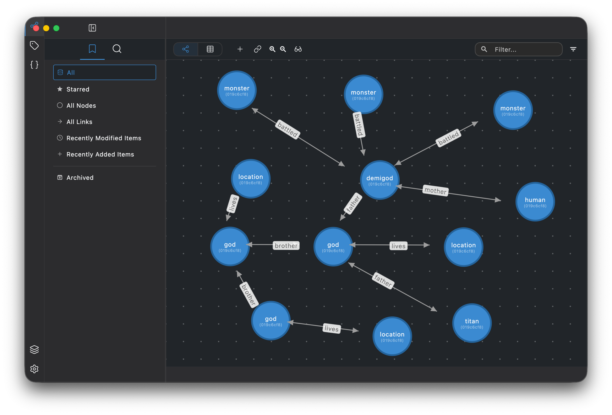

# RinneGraph

[日本語](README.ja.md)

[](https://cla-assistant.io/szktty/rinne-graph-desktop)
[](https://www.gnu.org/licenses/agpl-3.0)
[](https://flutter.dev)
[](README.md)
[](CONTRIBUTING.md)



**⚠️ WORK IN PROGRESS - ALPHA STAGE ⚠️**

RinneGraph is a **local and offline** graph-based personal knowledge management app. It visualizes the connections between pieces of information, helping you intuitively grasp the bigger picture.

## 🚧 Project Status

**This project is in Alpha stage.**

- ❌ **Not ready for production use**
- ❌ **Features are incomplete and may not work as expected**
- ❌ **Breaking changes may occur frequently**
- ✅ **Feedback and bug reports are welcome**

**Current Focus**: Building MVP (Minimum Viable Product) for early feedback collection.

## 🔍 How is RinneGraph Different?

Tools like Obsidian and Logseq also offer graph views, but their underlying data model is still **files** — the graph is a visualization of links between documents. RinneGraph is different: the data model itself is a property graph, where any entity can be a node and any relationship can be an edge, each carrying its own properties. This finer-grained structure lets you represent knowledge that doesn't fit neatly into documents or outlines.

At the same time, full-featured graph databases like Neo4j or ArangoDB require a server, are built for developers, and do not support macOS, Windows, or mobile as desktop apps. RinneGraph brings that expressive data model to a **local, offline, GUI-first desktop app** — no server, no setup, and your data stays yours alone.

## 💡 Features

- **Local-first & offline** — works entirely on your device, no graph database server required
- Organize personal data using a graph database structure (nodes and links)
- Visualize relationships between different pieces of information
- Search and navigate through your data efficiently
- Manage data in self-contained "stacks" (portable database units)

## 🚀 Quick Start

### Prerequisites

- Flutter 3.41.2 or higher
- Dart 3.11.0 or higher
- Melos (monorepo management tool)

### Supported Platforms

- ✅ **macOS** (Primary support)
- ✅ **Windows** (Experimental support)

**Note**: Windows support is experimental. The application should build and run, but some features may not work as expected. Feedback is welcome!

### Setup

```bash
# Clone the repository
git clone https://github.com/szktty/rinne_graph_desktop.git
cd rinne_graph_desktop

# Install dependencies (using Melos for monorepo management)
flutter pub get
melos bootstrap

# Run the desktop app
cd apps/desktop
flutter run -d macos  # or -d windows
```

### Build

```bash
# macOS
cd apps/desktop
flutter build macos

# Windows
cd apps/desktop
flutter build windows

# Or use the build script (macOS only)
./scripts/build.sh
```


## 📚 Documentation

- [Development Strategy](docs/strategy/governance/DEVELOPMENT_STRATEGY.md) - Project development approach and release cycle
- [Publishing Checklist](docs/strategy/governance/PUBLISHING_CHECKLIST.md) - MVP release preparation tasks

## 🐛 Reporting Issues

This project is in early development. If you encounter bugs or have suggestions:

1.  Check existing [Issues](https://github.com/szktty/rinne-graph-desktop/issues) to avoid duplicates (Replace with actual public URL)
2.  Create a new issue with detailed information:
    *   Steps to reproduce
    *   Expected vs actual behavior
    *   Your environment (OS, Flutter version, etc.)

**Note**: Response time may vary as this is a personal project under active development.

## 📄 License

This project is licensed under the **GNU Affero General Public License v3.0 (AGPLv3)**. See the [LICENSE](LICENSE) file for details.

### Contributing & CLA

Contributions are welcome! By submitting a Pull Request, you agree to the [Contributor License Agreement (CLA)](https://gist.github.com/szktty/098a5717a813146dd797e557400a31c1). See [CONTRIBUTING.md](CONTRIBUTING.md) for details.

### Commercial License

A **commercial license** will be available in the future for organizations or individuals who need to use RinneGraph without the obligations of the AGPLv3 (e.g., source disclosure requirements for network-deployed services, internal enterprise use).

If you are interested in a future commercial license or have any licensing inquiries, please contact:

**contact@szktty.jp**

## Versioning

This project uses a hybrid versioning strategy, separating the user-facing **Display Version** from the tool-facing **Technical Version**. Version generation is automated through Melos scripts.

### Technical Version (`pubspec.yaml`)

For compatibility with the Dart package manager (`pub`), the version in `pubspec.yaml` adheres to the Semantic Versioning (SemVer) format `MAJOR.MINOR.PATCH+BUILD_METADATA`.

- **Format:** `0.YYMMDD.Build+CommitHash`
- **Example:** `0.251013.1+a1b2c3d`

**Components:**
- **`0.`**: The major version is fixed at `0` to indicate that the project is not yet stable (pre-1.0.0).
- **`YYMMDD`**: The minor version is the date of the build in `YYMMDD` format.
- **`Build`**: The patch version is an incrementing number for builds made on the same day.
- **`+CommitHash`**: The build metadata contains the short Git commit hash, allowing any build to be traced back to its exact source code. This part is ignored by SemVer for precedence comparison.

### Display Version (UI & Logs)

Human-readable version string shown in the app's "About" screen.

-   **Format:** `[Stage] Build YY.MM.DD.Build (CommitHash)`
-   **Example:** `Alpha Build 25.10.13.1 (a1b2c3d)`

This dual approach ensures the project's versioning is both tool-compatible and human-friendly, providing clarity and traceability.

## 💖 Sponsorship

RinneGraph is a personal open-source project developed in my spare time. If you find it useful, consider supporting development via [GitHub Sponsors](https://github.com/sponsors/szktty). Any support is greatly appreciated and helps keep the project going.
